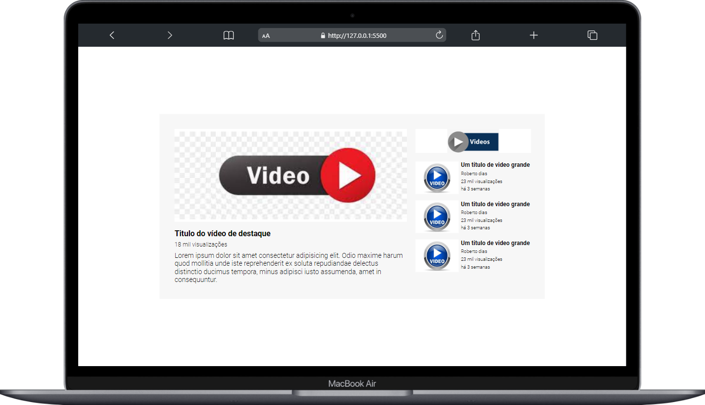

#  Exercício de Layout YouTube com Grid e Flexbox

## Visão Geral 🚀 
Bem-vindo ao meu projeto de exercício de layout para reproduzir a página inicial do YouTube! Este projeto foi desenvolvido com foco no aprimoramento das habilidades de layout usando as tecnologias Grid e Flexbox.

## Emoções Envolvidas 🚀😎
### Desafio Aceito!
Este projeto teve início como parte de um exercício no curso DEVEMDOBRO, com o objetivo de aprimorar as habilidades no uso de Grid e Flexbox. Além disso, configurou-se como um desafio pessoal para elevar as competências adquiridas no módulo de CSS avançado. A missão central consistiu em recriar a complexidade visual da página inicial do YouTube, um dos sites mais populares da interne

### Empolgação Grid
A utilização do sistema de layout Grid proporcionou uma organização estruturada e eficiente. As áreas definidas no grid facilitaram a disposição dos elementos, resultando em uma experiência de codificação mais fluida.

### Flexbox para o Resgate
Ao incorporar o Flexbox, pude criar layouts flexíveis. A capacidade de ajustar dinamicamente a disposição dos elementos,foi uma verdadeira vitória.

### Suor da Testa
Ao longo do processo, enfrentei alguns desafios que exigiram dedicação e resolução criativa. Encontrar soluções para alinhar elementos, definir proporções e lidar com diferentes resoluções foi uma jornada desafiadora, mas incrivelmente gratificante.

## Preview 📸

## Personalização 🎨
Sinta-se à vontade para Layout YouTube acordo com suas preferências. Você pode modificar o estilo, adicionar mais funcionalidades ou integrá-lo a outras tecnologias.

## Tecnologias Utilizadas  💻
 A linguagem de marcação padrão para criar a estrutura da página.

 Utilizando Grid e Flexbox, o CSS cria um design agradável.

## Contribuição 🤝
Contribuições são bem-vindas! Se você encontrar bugs ou tiver sugestões de melhorias, sinta-se à vontade para abrir uma issue ou enviar um pull request.

### Agradeço por conferir meu projeto! Espero que este exercício tenha sido tão emocionante para você quanto foi para mim. Se tiver dúvidas ou sugestões, sinta-se à vontade para entrar em contato.

### Divirta-se codificando! 😊 

## Contato 📲

### me segue nas redes abaixo!
 

 
  
  
  
  

